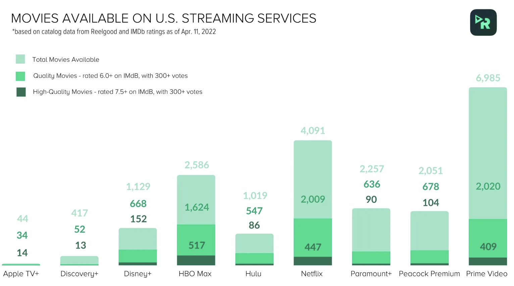

# Introduction

Streaming services’ market is considerably growing each year. They are revolutionizing the movie industry. For a long period of time, Netflix was dominating the market in all aspects. Now the streaming war is raging on. The King is being overtaken by growing competitors like Disney plus, Amazon Prime and HBO. To come on top of this furious battle, each streaming service is now launching its own content in addition to acquiring old content. For consumers, choosing which streaming platform to subscribe to is becoming harder than ever. Our goal is to provide insights on which platform offers the best value for movie lovers and help users make informed decisions when choosing a streaming service. We will focus on analyzing movies available on Netflix and Amazon Prime to determine which platform offers a better selection. We will be using data on movie ratings, genre, and other relevant features to compare the two platforms.

  
*[source](https://blog.reelgood.com/which-streaming-service-offers-the-best-bang-for-your-buck)*


# Motivation
We constructed our dataset by using the imdb movie data and augmenting it with the availability on the corresponding 
streaming service using the moviedb api. For each movie in the imdb dataset we made a call to the api to check the movie 
is available on which streaming service. We then explored our obtained dataset and decided to focus our study on the US market, because this is where we had the most data.

After that we looked at the different streaming services and found that we had the most data for Netflix and Amazon Prime, 
so we decided to focus our study on these two platforms. After constructing our dataset we ended up with 6981 movies for 
Amazon Prime, and 2915 movies on Netflix. Using the blog post above, if we assume that the movies on those two platforms
did not change we would have 99% of movies on Prime and 60% of movies on Netflix. We will see in the following parts how we 
will handle this issue.

To measure quality we decided to use the imdb rating, because it is a well known metric and it is used by many people to
decide which movie to watch. 

  


# Exploration and Preleminary Findings

### IMDB Rating Distribution


### Runtime in minutes, Release Year and Number of Votes Distribution

### Genres Radar Chart 
TODO

### Writers and Directors Distribution
TODO
### Production Companies Map


# [🔎 🗺️](another-page.md)

### Sentiment & Topics on Prime and Netflix

<br/><br/>


## Hypothesis and Strategy motivation


# Observational Study
### Features after matching

### Matching without directors

### Matching directors 


# Conclusion

*   This is an unordered list following a header.
*   This is an unordered list following a header.
*   This is an unordered list following a header.

##### Header 5

1.  This is an ordered list following a header.
2.  This is an ordered list following a header.
3.  This is an ordered list following a header.

###### Header 6

| head1        | head two          | three |
|:-------------|:------------------|:------|
| ok           | good swedish fish | nice  |
| out of stock | good and plenty   | nice  |
| ok           | good `oreos`      | hmm   |
| ok           | good `zoute` drop | yumm  |

### There's a horizontal rule below this.

* * *

### Here is an unordered list:

*   Item foo
*   Item bar
*   Item baz
*   Item zip

### And an ordered list:

1.  Item one
1.  Item two
1.  Item three
1.  Item four

### And a nested list:

- level 1 item
  - level 2 item
  - level 2 item
    - level 3 item
    - level 3 item
- level 1 item
  - level 2 item
  - level 2 item
  - level 2 item
- level 1 item
  - level 2 item
  - level 2 item
- level 1 item

### Small image


### Large image


### Definition lists can be used with HTML syntax.

<dl>
<dt>Name</dt>
<dd>Godzilla</dd>
<dt>Born</dt>
<dd>1952</dd>
<dt>Birthplace</dt>
<dd>Japan</dd>
<dt>Color</dt>
<dd>Green</dd>
</dl>

```
Long, single-line code blocks should not wrap. They should horizontally scroll if they are too long. This line should be long enough to demonstrate this.
```

```
The final element.
```
