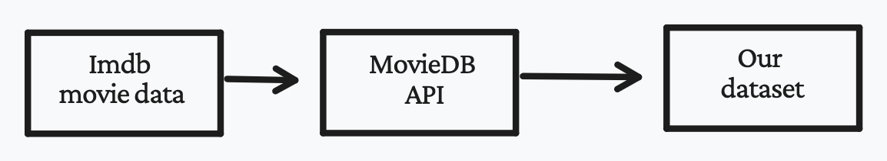

# A fierce war 

Streaming services’ market is considerably growing each year. They are revolutionizing the movie industry. For a long period of time, Netflix was dominating the market in all aspects. Now the streaming war is raging on. The King is being overtaken by growing competitors like Disney plus, Amazon Prime and HBO. To come on top of this furious battle, each streaming service is now launching its own content in addition to acquiring old content. For consumers, choosing which streaming platform to subscribe to is becoming harder than ever. Our goal is to provide insights on which platform offers the best value for movie lovers and help users make informed decisions when choosing a streaming service. We will focus on analyzing movies available on Netflix and Amazon Prime to determine which platform offers a better selection. We will be using data on movie ratings, duration, genre and other relevant features to compare the two platforms.



# Where's your favorite movie?

As streaming platforms continue to grow and evolve, it can be difficult to keep track of what movies are available on which platforms. Netflix and Amazon Prime don't provide data about the movies they are offering. Addintionaly, there are no up to date datasets about movies on different platform. Therefore, we decided to take matters into our own hands.

To construct our dataset, we used the IMDb movie data and augmented it with information on which streaming services each movie was available on, using the MovieDB API. For each movie in the IMDb dataset, we made a call to the API to check which streaming platforms it was available on. 

  

We then explored our obtained dataset and decided to focus our analysis on the US market, where the competition between streaming platforms is fierce. After looking at the various streaming services, we found that we had the most data for movies available on Netflix and Amazon Prime. In total, we ended up with 6981 movies for Amazon Prime and 2915 movies for Netflix. If we assume that the movie offerings on these two platforms did not *[change](https://blog.reelgood.com/which-streaming-service-offers-the-best-bang-for-your-buck)*, we would have access to 99% of movies on Prime and 60% of movies on Netflix. In the following sections of our data story, we'll explore how we can handle this issue and compare the movies on these platforms in more detail.

-- INFO, PLOTS ABOUT MOVIES ON US COMPARED TO MOVIES ON OTHER COUNTRIES, PLOTS COMPARINF NUMBER OF MOVIES ON AMAZON AND PRIME

In the following sections, we'll delve deeper into the data and compare the ratings, genres, and other features of the movies on Netflix and Amazon Prime to see which platform offers the best value for movie lovers. Stay tuned to see the results of our analysis!

# Let's explore and compare both platforms

Several factors can be considered when comparing Amazon Prime and Netflix movies

### International movies

# [🔎 🗺️](another-page.md)
Netflix in general has more international movies than Prime

### Genres Radar Chart 


### Writers and Directors Distribution

### Production Companies Map

### Runtime in minutes, Release Year, ###### ADD REVENUE


### Sentiment & Topics on Prime and Netflix

In our research to determine if Netflix had better quality movies than Amazon Prime, we looked at the description of the movies. First, we were interested in the sentimental aspect of these descriptions. The sentiment of a movie can be defined by two values: polarity and subjectivity. The polarity determines how negative/positive a text is, and the subjectivity how objective/subjective it is.  
The two plots below show you the distribution of polarity and subjectivity for Netflix and Prime. We can see that Prime has slightly more negative movie descriptions than Netflix. This difference in distribution could have an effect on the rating of movies between the different platforms. Indeed, it could be possible that movies with a "negative" feeling are less well rated in general or vice versa. In order to have the most robust comparison possible between the ratings of Neflix and Prime, we will therefore take into account the polarity of the films in our observational study, in order to limit this potential bias as much as possible. Subjectivity would rather allow us to choose which films we would choose for our observational study. Indeed, objective descriptions (thus with a subjectivity score close to zero) would be more rigorous to analyze, because it limits a certain bias towards the films. However, given the distribution, keeping only the films with a low subjectivity would have left us with too few films, impacting too much the robustness of our observational study. For this reason we did not keep this metric in the rest of our analysis. 


  

Then we are interested in a Latent Dirichlet Allocation (LDA) to extract topics from the movie description. Once twelve topics were extracted, we computed for each streaming service and each of their movies, the distribution among these topics. We then aggregated the results by grouping the distribution by streaming service, and obtained the graph below. We can see that Netflix and Prime seem to have almost exactly the same distribution of topics. This may be due to a weak LDA model, or to the fact that the selected topics do not allow to differentiate between Netflix and Prime. We have seen that the distribution of movie categories differed between Netflix and Prime, however to observe the same distribution in our topics, we would need each topic to represent a genre, and the movie description to match this genre in our LDA model.  Given the similar distribution of topics on the two streaming services, we therefore did not consider them for our observational study.



## Hypothesis and Strategy motivation

### IMDB Rating Distribution and Number of Votes Distribution
IMDb allows users to rate films on a scale of 1 to 10, and these ratings are used to calculate a weighted average for 
each film, series, and so on. IMDb uses filters to ensure the accuracy and legitimacy of these ratings, and the 
specific method for doing so is not publicly disclosed in order to prevent attempts to manipulate the system. 
It is worth noting that the weighted average may sometimes differ significantly from the arithmetic mean due 
to these filters.



In general, Netflix movies have higher frequency of average rated movies than Amazon Prime. Is this comparison reliable?
Is it valid to compare a comedy movie with an action movie? Is it valid to compare a 1 
hour movie with a 3 hours movie? 

These are all confounding variables that complicate the interpretation of our study results to determine if Netflix 
has really higher quality of movies.

# Observational Study

Matching is a useful tool for helping to control for confounding variables in observational studies, 
which can help to increase the validity and reliability of the study results.

### Features after matching

### Matching without directors

### Matching directors 


# Conclusion

*   This is an unordered list following a header.
*   This is an unordered list following a header.
*   This is an unordered list following a header.
