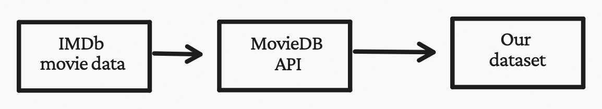

 <h1>Does Netflix offer higher quality movies than Amazon Prime?</h1> 

# A fierce war 

The streaming services market is considerably growing each year. They are revolutionizing the movie industry. For a long time, Netflix was dominating the market in all aspects. Now the streaming war is raging on. The King is being overtaken by growing competitors like Disney Plus, Amazon Prime, and HBO. To come on top of this furious battle, each streaming service is now launching its content in addition to acquiring old content. For consumers, choosing which streaming platform to subscribe to is becoming harder than ever. Our goal is to provide insights into which platform offers the best value for movie lovers and help users make informed decisions when choosing a streaming service. We will focus on analyzing movies available on Netflix and Amazon Prime to determine which platform offers a better selection. We will be using data on movie ratings, duration, genre, and other relevant features to compare the two platforms.



# Where's your favorite movie?

As streaming platforms continue to grow and evolve, it can be difficult to keep track of what movies are available on which platforms. Netflix and Amazon Prime don’t provide data about the movies they are offering. Additionally, there are no up-to-date datasets about movies on different platforms. Therefore, we decided to take matters into our own hands.
To construct our dataset, we used the IMDb movie data and augmented it with information on which streaming services each movie was available on, using the MovieDB API. For each movie in the IMDb dataset, we made a call to the API to check which streaming platforms it was available on.

  

We then explored our obtained dataset and decided to focus our analysis on the US market, where the competition between streaming platforms is fierce. After looking at the various streaming services, we found that we had the most data for movies available on Netflix and Amazon Prime. In total, we ended up with 6981 movies for Amazon Prime and 2915 movies for Netflix. If we assume that the movie offerings on these two platforms did not change, we would have access to 99% of movies on Prime and 60% of movies on Netflix.

In the following sections, we’ll delve deeper into the data and compare the ratings, genres, and other features of the movies on Netflix and Amazon Prime to see which platform offers the best value for movie lovers.

# Let's explore 

### Looking for international movies?

This map represents the number of movies per production country. We see a higher number of movies produced in the US, which means that we can use this feature in our observational study as it does not limit the number of movies at our disposal.


# [🔎 🗺️](another-page.md)

### With your favorite genre?


This radar chart shows the ten most common genres on both platforms. It appears that the genres are distributed similarly, with drama being the most common. However, the distributions are not the same. For instance, comedy movies are more frequent on Netflix than on Prime. 

### With your favorite director?


This bar plot represents the distribution of twenty directors with most movies on both platforms. Do you recognize any of them? 

### Runtime in minutes, Release Year, Number of Votes, and The sentiment


As we can see in the plots above, the distribution of runtime, release year, the number of votes, and sentiment are different on the platforms. Thus we cannot simply compare the average of the movies on the two platforms and conclude that one platform offers better movies. We need to take into account the differences in the distribution of the features.

### Sentiment & Topics on Prime and Netflix

In our research, we set out to compare the quality of movies on Netflix and Amazon Prime. To do this, we examined the descriptions of the movies on each platform.

One aspect of movie descriptions that can be helpful in analyzing their quality is sentiment. Sentiment is made up of two values: polarity and subjectivity. Polarity refers to how positive or negative a movie's description is, while subjectivity measures how objective or subjective it is.

We plotted the distribution of polarity and subjectivity for movies on both Netflix and Amazon Prime, and found that Prime had slightly more negative movie descriptions than Netflix. This difference in distribution could potentially impact the ratings of movies on the two platforms. For example, it's possible that movies with a "negative" feeling are rated lower overall, or vice versa.

To ensure that our comparison of movie ratings on Netflix and Prime was as unbiased as possible, we decided to take the polarity of the movies into account in our observational study. We also considered using subjectivity to select movies for our study, as objective descriptions (with a subjectivity score close to zero) would be more reliable to analyze. However, limiting our selection to movies with low subjectivity would have left us with too few films, compromising the robustness of our study. As a result, we did not include subjectivity in the rest of our analysis.


  

To gain a deeper understanding of the movies on Netflix and Amazon Prime, we used a technique called Latent Dirichlet Allocation (LDA) to extract topics from their descriptions. After extracting twelve topics, we calculated the distribution of these topics for each movie on each platform.

When we plotted the results, we found that the distribution of topics for Netflix and Amazon Prime was almost exactly the same. This could be due to a weak LDA model, or it could be that the selected topics weren't specific enough to differentiate between the two platforms.

In order to observe a difference in the distribution of topics between Netflix and Prime, each topic would need to represent a specific genre and the movie descriptions would need to match this genre in the LDA model. Since the distribution of topics was similar on both platforms, we did not consider them in our observational study.



Below are represented as word clouds important words of three of the topics we found. The first one on the left is “The Search for Purpose” then “Love and Romance” and finally “Crime and Punishment”. We see words in each word cloud related to the topic, but there are also some outliers in each word cloud, proving our LDA may not be perfect.

## Hypothesis and Strategy motivation

### IMDB Rating Distribution and Number of Votes Distribution
IMDb is a great resource for film ratings, as users can rate movies on a scale of 1 to 10. These ratings are then used to calculate a weighted average for each film, series, and so on.

But how do we know that these ratings are accurate and legitimate? IMDb uses filters to ensure the integrity of their ratings, though the specific method for doing so is kept confidential to prevent manipulation of the system.

It's also worth noting that the weighted average may sometimes differ significantly from the arithmetic mean due to these filters. So, next time you're looking for a new movie to watch, don't forget to check out the ratings on IMDb!



Here are the p-values that the two streaming services have equal means for the following features and rating:

| Feature      | P-value |
| ----------- | ----------- |
| Runtime      | 0       |
| Release Year   | 0        |
| Number of votes   | 0        |
| Polarity of the overview   | 0        |
| IMDb average Rating | 0        |

In general, Netflix movies have higher frequency of average rated movies than Amazon Prime. Is this comparison reliable? Is it valid to compare a comedy movie with an action movie? Is it valid to compare a 1 
hour movie with a 3 hours movie? 

These are all confounding variables that complicate the interpretation of our study results to determine if Netflix has really higher quality of movies.

# Observational Study

Movies can have different features, such as genre or release year, and running time, which can influence the ratings of a movie. That’s why, to get an unbiased comparison of movie ratings on Netflix and Amazon Prime, it’s important to minimize the difference in features between the movies on each platform.

To do this, we will conduct an observational study. By carefully selecting movies with similar features and matching them, we can reduce the impact of these features on the ratings and get a more accurate comparison of the quality of movies on Netflix and Prime.

Here are the features we considered when matching movies on Netflix and Amazon Prime:
* *Average rating*: the average rating of a movie on IMDb
* *Number of votes*: the number of votes a movie has received on IMDb
* *Release year*: the year a movie was released
* *Runtime*: the length of a movie in minutes
* *The polarity of the overview*: whether a movie overview is positive or negative
* *Genres*: the genres of a movie
* *Production Countries*: the countries where a movie was produced
### Graph with potential matchings 

  

  
[*Link to the graph in full resolution*](http://data-story.best-ada-project.ch/assets/images/matching_movies.png)

The nodes in this graph represent the movies in our dataset, and there exists an edge between two nodes if they could 
potentially be matched. 

There is an edge between two movies if:
* They have the same genres
* They have the same production countries
* They have a similarity score greater than a threshold

This insures that the matched movies will have similar features and by not only relying on the similarity score, we also have a speedup in the matching process because a lot of potential edges are eliminated.

Here is a link to an interactive version of the graph: [*Our Matchings Graph*](https://matchings-graph.best-ada-project.ch)

### Features after matching


After our matching process, the distributions became much more similar! This is a great indication that our matching was effective and now we can confidently compare the ratings on both platforms without bias.

### Matching without production countries

Here are the p-values that the two streaming services have equal means for the following features and rating:

| Feature      | P-value |
| ----------- | ----------- |
| Runtime      | 0       |
| Release Year   | 0        |
| Number of votes   | 0        |
| Polarity of the overview   | 0.09        |
| IMDb average Rating | 0        |

### Matching with the production countries 


Here are the p-values that the two streaming services have equal means for the following features and rating:

| Feature      | P-value |
| ----------- | ----------- |
| Runtime      | 0.29       |
| Release Year   | 0        |
| Number of votes   | 0        |
| Polarity of the overview   | 0.12       |
| IMDb average Rating | 0        |

# Conclusion

In conclusion, our study found that, in general, Netflix movies have a higher average rating than Amazon Prime movies. However, this comparison is not necessarily reliable due to the presence of confounding variables, such as genre and running time, which can complicate the interpretation of the results.

To address this issue, we used matching techniques to control for these confounding variables in our analysis. By matching movies on Amazon Prime and Netflix based on genre, running time, number of votes, and polarity of the overview we were able to better compare movies that are more similar in terms of these factors. Our results showed that, even after matching, 
Netflix still had higher rated movies compared to Amazon Prime.

We also tried to includ the production country, and found that the results were similar to the ones we got when we did not.

Overall, our study highlights the importance of considering confounding variables in observational studies, and the usefulness of matching techniques in controlling for these variables. While our results suggest that Netflix movies may have a higher quality compared to Amazon Prime movies, further research is needed to fully understand the factors that contribute to this difference.
